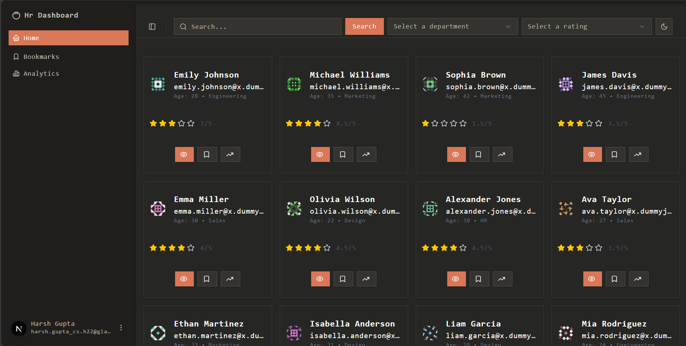
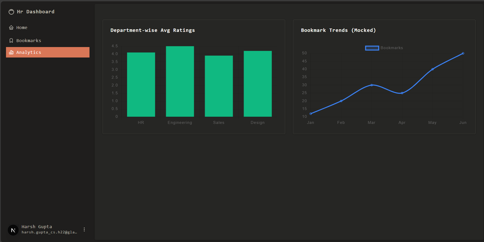
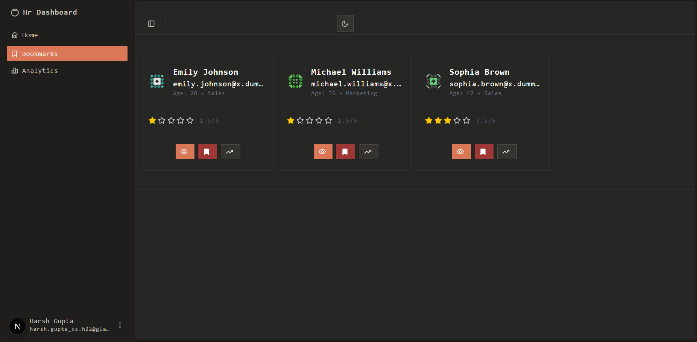
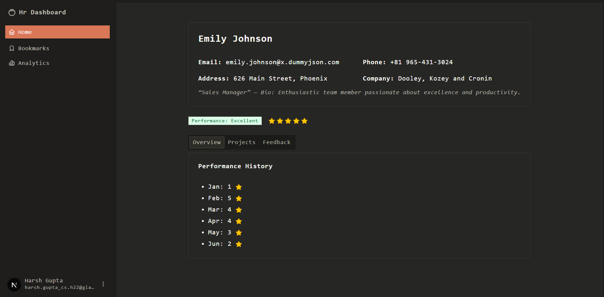

# HR Dashboard

A modern and responsive HR dashboard built with **Next.js 14**, **Tailwind CSS**, **ShadCN UI**, and **Chart.js**. This dashboard visualizes employee data, including department-wise average ratings and bookmark trends.

---

## 🚀 Setup Instructions

### 1. Clone the repository

git clone https://github.com/your-username/hr-dashboard.git
cd hr-dashboard

### 2. Install dependencies
npm install

### 3. Start the development server
npm run dev

The app will be available at http://localhost:3000.

🔧 Features Implemented
✅ Department-wise average rating chart using Chart.js

✅ Bookmark trends visualization (mocked data)

✅ Sidebar layout using ShadCN's AppSidebar

✅ Responsive design using Tailwind utility classes

✅ Theme switcher (light/dark/system)

✅ Global state management with Context API

✅ Clean, maintainable folder structure

### 📍 Home Page

### 📍 Analytics Page 

### 📍 Bookmark Page 

### 📍 employee-details Page  

